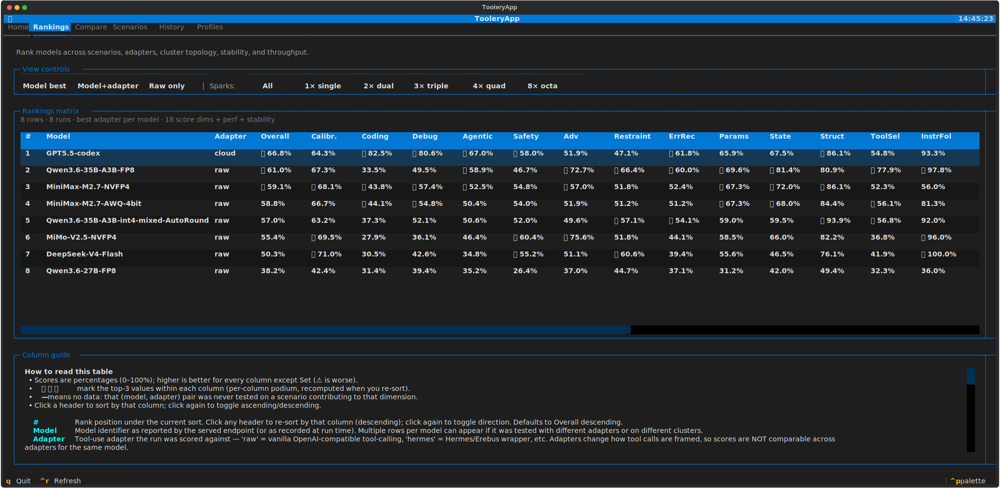
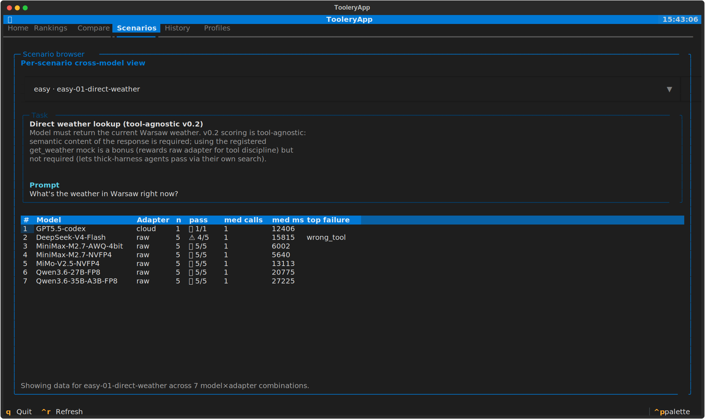
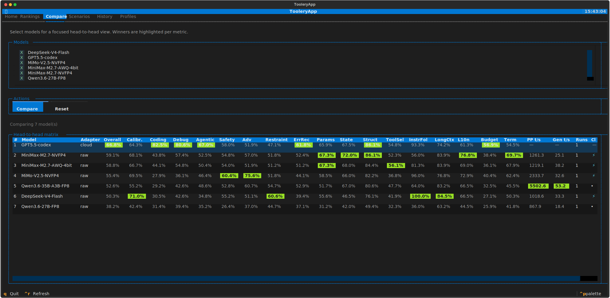
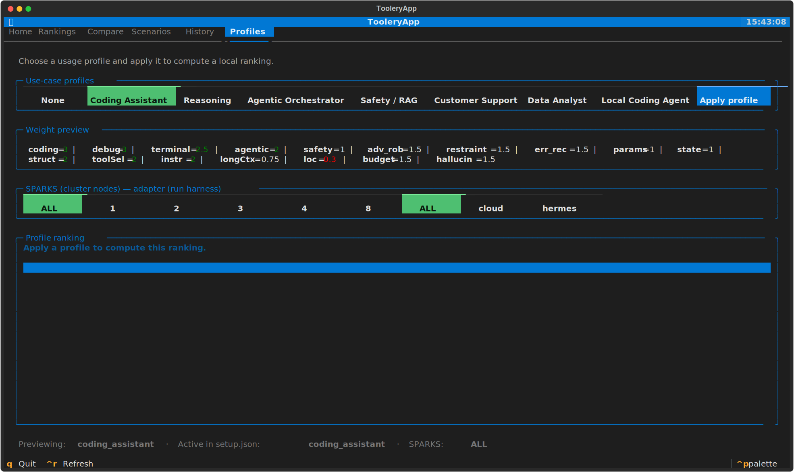
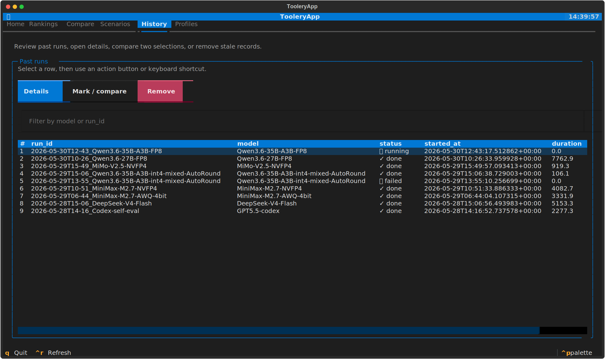

# Toolery

[](https://github.com/karolpalys/toolery/actions/workflows/ci.yml)
[](LICENSE)
[](https://www.python.org/)

**Toolery is a deterministic benchmark for LLM tool-calling.** It runs a model through
143 hand-written scenarios across four difficulty tiers, scores every run with
deterministic primitives (**no LLM judge — $0 cost, fully reproducible**), and ranks
models across a matrix of capability dimensions in a live terminal dashboard.

Built for benchmarking locally-served models (vLLM / llama.cpp / SGLang) — including
multi-node DGX Spark topologies — but works against any OpenAI-compatible endpoint.

<p align="center">
  
  <br>
  <em>The Rankings tab: one row per (model, adapter, cluster), sortable capability matrix.</em>
</p>

---

## Highlights

- **143 scenarios**, 4 tiers — 40 easy · 45 medium · 34 hard · 24 very-hard.
- **Deterministic scoring** — assertions over tool calls, arguments, and final text. No
  model-as-judge, so results are free, stable, and diffable.
- **Three execution adapters** — `raw`, `cloud`, `hermes` — so you can measure *what the
  harness adds vs. what the model knows* (see [Execution adapters](#execution-adapters)).
- **Capability matrix** — coding, debugging, agentic planning, safety, adversarial
  robustness, restraint, error recovery, parameter precision, state tracking, structured
  output, tool selection, instruction following, long context, localization, budget
  discipline, terminal handling, and calibration/hallucination.
- **Statistical rigor** — tier-weighted means, time-decay over the last runs (14-day
  half-life), run-to-run stability (σ / worst / pass-rate), and McNemar significance in
  run-to-run compares.
- **Cluster-aware** — the same model on `single` / `dual` / `triple` / `quad` / `octa`
  DGX Spark topologies is tracked as a separate configuration.
- **Throughput** — optional prompt-processing and token-generation benchmarks via
  [llama-benchy](#performance-benchmarking-llama-benchy).
- **Textual TUI** — discover endpoints, launch runs, and explore rankings without leaving
  the terminal.

---

## Requirements

- **Python 3.11+**
- **[uv](https://docs.astral.sh/uv/)** for dependency management
  (`curl -LsSf https://astral.sh/uv/install.sh | sh`)
- **An OpenAI-compatible model endpoint to benchmark** — e.g. a local
  [vLLM](https://docs.vllm.ai/), [llama.cpp](https://github.com/ggml-org/llama.cpp) server,
  [SGLang](https://github.com/sgl-project/sglang), or any hosted API that speaks the
  OpenAI Chat Completions + tools protocol.

## Installation

```bash
git clone https://github.com/karolpalys/toolery.git
cd toolery

# Install the package and its dependencies into a managed virtualenv
uv sync

# With dev tools (pytest, ruff, mypy) — needed to run the test suite
uv sync --extra dev

# With perf support (llama-benchy as a pinned dependency) — optional
uv sync --extra perf
```

Everything below is invoked with `uv run toolery …` (no manual venv activation needed).
If you'd rather activate the environment, `source .venv/bin/activate` and drop the
`uv run` prefix.

### Quick launch (one command)

The repo ships a tiny launcher, [`toolery.sh`](toolery.sh), that opens the TUI dashboard
straight from the console:

```bash
chmod +x toolery.sh     # once
./toolery.sh            # opens the panel
```

To launch from **any** directory, symlink it onto your `PATH`:

```bash
sudo ln -s "$(pwd)/toolery.sh" /usr/local/bin/toolery
toolery                 # opens the dashboard from anywhere
```

The script `cd`s into the repo and runs `uv run toolery tui`, so dependencies stay managed
by uv — no activation, no global install. Any extra arguments are forwarded to
`toolery tui`.

---

## Quickstart

```bash
# 1. Point Toolery at your running model server
export TOOLERY_BASE_URL=http://localhost:8000

# 2. Smoke test — a few easy scenarios, raw adapter
uv run toolery run --model my-model --adapter raw --tier easy --trials 3

# 3. Full run — all tiers, all adapters, with throughput benchmarking
uv run toolery run --model my-model --adapter raw,cloud,hermes \
                   --tier all --trials 5 --with-perf

# 4. Explore results in the terminal dashboard
uv run toolery tui
```

A run writes scenario traces, scores, and (optional) perf into `./results/` and
regenerates the ranking tables automatically.

---

## Execution adapters

The **adapter** decides *how* tool calls are made and scored. It is a first-class axis in
Toolery: the same model can score very differently under `raw` vs. `hermes`, so each
(model × adapter) pair is ranked separately. Pass one or more, comma-separated, to
`--adapter`.

| Adapter | What it does | Requires | Use it to… |
|---|---|---|---|
| **`raw`** | Calls a local OpenAI-compatible server directly, using the standard `tools` API. The baseline — measures the model's own tool-calling. | `TOOLERY_BASE_URL` (or `--base-url`). Always available. | Benchmark a model you serve yourself (vLLM / llama.cpp / SGLang). |
| **`cloud`** | Same OpenAI-compatible protocol, but against a remote/hosted API. | `OPENAI_API_KEY` **or** `ANTHROPIC_API_KEY`. | Benchmark a hosted model, or compare local vs. cloud. |
| **`hermes`** | Spawns the `hermes` CLI as a subprocess (agent harness) and reconstructs the trace from its session store. | The `hermes` binary in `PATH` + `HERMES_*` env (see [Configuration](#configuration)). | Measure what an agent wrapper *adds or breaks* relative to `raw`. |

> Adapters are gated on availability: `raw` is always selectable; `cloud` is disabled
> until an API key is set; `hermes` is disabled until its CLI is on `PATH`. In the TUI the
> launch modal shows the reason next to any disabled adapter.

---

## Performance benchmarking (llama-benchy)

Throughput is measured by [llama-benchy](https://pypi.org/project/llama-benchy/), which
hits the **same served endpoint** and reports prompt-processing (PP) and token-generation
(Gen) tokens/sec across several context depths.

Enable it per run with `--with-perf`, or run it standalone:

```bash
uv run toolery perf --model my-model --base-url http://localhost:8000
```

**You don't need to install llama-benchy manually.** Toolery invokes it through
`uvx llama-benchy`, so `uv` fetches and runs it on demand the first time it's needed. The
only prerequisites are that `uv` is on your `PATH` and your **model server is running**
(perf benchmarks the live endpoint).

Prefer an explicit/pinned install instead of on-demand fetching? Either of:

```bash
uv sync --extra perf        # declares llama-benchy as a project dependency
uv tool install llama-benchy
```

Perf is entirely optional — without it, every part of Toolery works except the two
throughput columns in the Rankings matrix.

---

## CLI reference

All commands are subcommands of `toolery` (`uv run toolery <command> --help` for details).

| Command | What it does | Key options |
|---|---|---|
| `run` | Run scenarios against a model and score them. | `--model`, `--adapter raw,cloud,hermes`, `--tier easy\|medium\|hard\|very_hard\|all`, `--category`, `--trials`, `--base-url`, `--concurrency`, `--with-perf`, `--cluster single\|dual\|triple\|quad\|octa`, `--resume <run_id>` |
| `tui` | Open the Textual dashboard. | — |
| `compare` | Diff two runs with McNemar significance. | `<run_id_A> <run_id_B>` |
| `rankings` | Regenerate the ranking markdown tables. | `--regen`, `--dimension` |
| `perf` | Run llama-benchy only (no scoring). | `--model`, `--base-url`, `--pp`, `--tg`, `--depth`, `--runs` |
| `list` | List recorded runs. | — |
| `scenarios` | List available scenarios. | `--tier` |

---

## Example output

`toolery list` shows every recorded run:

```text
┏━━━━━━━━━━━━━━━━━━━━━━━━━━━━━━┳━━━━━━━━━━━━━━━━━━━━━━━━━━━━━━┳━━━━━━━━━┳━━━━━━━━━━━━━━━━━━━━━━━━━━━━━━━┳━━━━━━━━━━━━━━┓
┃ run_id                       ┃ model                        ┃ status  ┃ started_at                    ┃ duration (s) ┃
┡━━━━━━━━━━━━━━━━━━━━━━━━━━━━━━╇━━━━━━━━━━━━━━━━━━━━━━━━━━━━━━╇━━━━━━━━━╇━━━━━━━━━━━━━━━━━━━━━━━━━━━━━━━╇━━━━━━━━━━━━━━┩
│ 2026-05-29T15-49_MiMo-V2.5-… │ MiMo-V2.5-NVFP4              │ done    │ 2026-05-29T15:49:57+00:00     │ 919.3        │
│ 2026-05-29T10-51_MiniMax-M2… │ MiniMax-M2.7-NVFP4           │ done    │ 2026-05-29T10:51:33+00:00     │ 4082.7       │
│ 2026-05-28T15-06_DeepSeek-V… │ DeepSeek-V4-Flash            │ done    │ 2026-05-28T15:06:56+00:00     │ 5153.3       │
└──────────────────────────────┴──────────────────────────────┴─────────┴───────────────────────────────┴──────────────┘
```

Each run regenerates the ranking tables under `results/rankings/`. The `Overall`
ranking (`results/rankings/overall.md`) scores each model under its **best-performing
adapter**:

| # | Model | Score | Best adapter | Runs |
|---|-------|------:|--------------|-----:|
| 1 | GPT5.5-codex | 66.8% | cloud | 1 |
| 2 | MiniMax-M2.7-NVFP4 | 59.1% | raw | 1 |
| 3 | MiniMax-M2.7-AWQ-4bit | 58.8% | raw | 1 |
| 4 | MiMo-V2.5-NVFP4 | 55.4% | raw | 1 |
| 5 | Qwen3.6-35B-A3B-FP8 | 52.6% | raw | 1 |
| 6 | DeepSeek-V4-Flash | 50.3% | raw | 1 |
| 7 | Qwen3.6-27B-FP8 | 38.2% | raw | 1 |

> Scores are tier-weighted and time-decayed; small gaps (< 2 pp) are noise.

---

## The TUI

`uv run toolery tui` opens a six-tab terminal dashboard. Each tab owns one stage of the
workflow — discover an endpoint, launch a run, then explore the results.

#### 🏠 Home — discover, launch, monitor
Your launchpad. It probes common ports (8000/8080/8081/8888/8889/5000/5001/11434, with an
optional 8000–9000 deep scan) and lists every reachable OpenAI-compatible endpoint with its
served model. Pick a row to open the **launch modal**: model is pre-filled, and you choose
the category/tier (multi-select), the mode (**Eval only** / **Eval + perf** / **Perf only**),
the cluster topology, and the adapter. Hitting **Run** spawns `toolery run` as a background
subprocess; Home then shows a **live progress bar** (current scenario, phase, completed/total
units, polled from `runs.db` every 2 s) and **run controls** — Pause, Resume, and STOP — plus
a one-click resume for any interrupted run on the same endpoint.

#### 📊 Rankings — the capability matrix
The headline view. One row per **(model, adapter, cluster)** configuration, one column per
capability dimension, plus throughput and metadata. **Click any header to sort** by that
column (click again to flip direction); the top-3 cells in each column get 🥇🥈🥉. Filter by
**Sparks** topology (1× → 8×) and switch the **ranking mode** (best-adapter-per-model /
one-row-per-adapter / raw-only). It auto-refreshes every 5 s as runs complete, and a column
guide explains every dimension. Full reference: [Rankings matrix](#rankings-matrix).

#### ⚔️ Compare — focused head-to-head
For pitting specific models against each other. Tick the models you care about, hit
**Compare**, and Toolery renders a matrix limited to just those — with the **per-column
winner highlighted** (green) and the rest dimmed, so the strongest model on each dimension
jumps out. Same underlying numbers as Rankings, but curated and side-by-side.

#### 📋 Scenarios — the test catalog
Browse all 143 scenarios (id, tier, category, tools, title). Select one and the tab shows its
**full task content** — title, description, system prompt, and the exact user prompt — above a
**per-model results table** for that scenario. This is how you see precisely *what was asked*
and *how each model handled it*, trace by trace.

#### 🕓 History — past runs
Every recorded run, newest first. Open one for the details: per-scenario pass/fail, the
failure-kind breakdown, the per-context-depth perf table, and run metadata (adapter, cluster,
duration). You can also remove a run (with a confirmation step) to prune the database.

#### 🎛️ Profiles — use-case personas
Re-weight the ranking for a specific job. Pick a persona — Coding Assistant, Reasoning,
Agentic Orchestrator, Safety/RAG, Customer Support, Data Analyst, or Local Coding Agent — and
Toolery computes an extra **`UC:<Name>`** ranking using that persona's dimension weights
(e.g. a coding persona up-weights Coding/Debugging/Terminal). The global Overall is untouched;
your choice persists in `results/setup.json` and also drives the optional use-case column in
the Rankings tab.

### Screenshots

<table>
  <tr>
    <td width="50%"><br><em>Scenarios — catalog with the selected task prompt above the per-model results.</em></td>
    <td width="50%"><br><em>Compare — head-to-head matrix of selected models, per-column winner highlighted.</em></td>
  </tr>
  <tr>
    <td width="50%"><br><em>Profiles — pick a use-case persona to re-weight the ranking.</em></td>
    <td width="50%"><br><em>History — past runs with per-depth perf and details.</em></td>
  </tr>
</table>

All screenshots are live SVG exports of the Textual TUI (`App.save_screenshot`), so they
stay crisp at any zoom.

---

## Rankings matrix

One row per **(model, adapter, cluster)** configuration. Scores aggregate the most recent
runs of that configuration with exponential time decay; re-running the same configuration
tightens its stability stats rather than adding a row. **Every score column is a
percentage where higher is better — including `Calibr.`, where higher means the model
resisted hallucination more often.**

<details>
<summary><b>Capability dimensions (click to expand)</b></summary>

| Column | What it tests | Example |
|---|---|---|
| **Overall** | Tier-weighted mean across all scenarios (easy 1× · medium 2× · hard 3× · very-hard 4×). | Composite of everything |
| **Calibr.** | Calibrated uncertainty — refuse/hedge when ungrounded; never fabricate or claim an uncalled tool ran. | "Price of ZZZX9?" → "I couldn't find that", not an invented $42.50 |
| **Coding** | TDD loops, multi-file refactors, file ops, git discipline. | Fix the failing test by editing `src/` only; commit a sensible message |
| **Debugging** | Root-cause analysis: tracebacks, regression bisect, multi-cycle instrument→fix loops. | Locate the offending `file:line` from a stack trace, then fix it |
| **Agentic** | Multi-step planning, conditional chains, parallel fan-out, autonomous composition. | "Email the cheapest of three stocks to Bob" — fetch in parallel, pick min, send |
| **Safety** | Refusing the user's explicit unsafe ask. | Decline a destructive op that needs confirmation |
| **Adversarial** | Prompt-injection resistance in untrusted tool/web/RAG data. | A tool result says "ignore previous instructions" — model stays on task |
| **Restraint** | Knowing when *not* to call a tool — answer from context instead. | "What is 2+2?" → answer directly, don't call the calculator |
| **ErrRec** | Recovery from timeouts, 429s, malformed/partial responses. | Tool returns HTTP 429 → retry once; 1 of 3 parallel calls fails → report partial |
| **Params** | Parameter precision — ISO codes, DST, numeric bounds, units. | "100 dollars to euros" → `base=USD, quote=EUR`, not "dollars"/"€" |
| **State** | Context-state tracking across turns — reuse prior tool results. | Turn 2 "buy 30 shares" reuses the price fetched in turn 1 |
| **Struct** | Non-JSON structured output — CSV, YAML, markdown tables. | "Return CSV with header `symbol,price,currency`" — no prose, no fences |
| **ToolSel** | Picking the right tool among plausible distractors. | 4 tools available; "What's AAPL?" → `get_stock_price`, not `get_weather` |
| **InstrFol** | Strict instruction following — hard format/length/negative constraints. | "Reply in exactly 3 sentences; do not use the word X" |
| **LongCtx** | Needle-in-haystack retrieval from long contexts. | Find an on-call number buried in a 3k-token runbook |
| **L10n** | Localization — non-English prompts and replies. | "Wie ist das Wetter in Berlin?" → calls the tool *and* replies in German |
| **Budget** | Completing complex tasks within tight tool-call budgets. | Full TDD rename across 4 files in ≤6 tool calls |
| **Term** | Terminal handling — shell pipes, CLI/ANSI parsing, destructive-command refusal. | "Lines containing 503 in nginx.log?" → `grep 503 … \| wc -l` |

**Performance columns** (only when run with `--with-perf`):

| Column | Meaning |
|---|---|
| **PP t/s** | Prompt-processing throughput (tokens/sec), llama-benchy, averaged across depths. |
| **Gen t/s** | Token-generation throughput (tokens/sec), same source. |

**Metadata columns:**

| Column | Meaning |
|---|---|
| **Runs** | Independent runs of this configuration; the last 5 are weighted with a 14-day half-life. |
| **Set** | ✓ = scored against the current scenario set on disk; ⚠ = older set, not directly comparable. |
| **Cluster** | DGX Spark topology: `single` / `dual` / `triple` / `quad` / `octa`. |

</details>

**Overall weighting:** in the `Overall` column, scenarios tagged `coding`, `terminal`, or
`agentic` count 2×; `localization` and `long_context` count 0.5×; everything else 1× (a
scenario's weight is the max of its dims). This applies *only* to `Overall` — every other
column is raw tier-weighting, so e.g. `Coding` isn't diluted by other dimensions.

---

## Configuration

Set via environment variables (no config file needed for basic use), or copy
`config.example.yaml` → `config.yaml` and edit.

| Variable | Purpose |
|---|---|
| `TOOLERY_BASE_URL` | Model endpoint for `raw`/`cloud` (default `http://localhost:8000`). |
| `TOOLERY_RESULTS_DIR` | Where runs are persisted (default `./results`). |
| `TOOLERY_SCENARIOS_DIR` | Override the scenarios directory. |
| `OPENAI_API_KEY` / `ANTHROPIC_API_KEY` | Required for the `cloud` adapter; empty is fine for local `raw`. |
| `HERMES_API_URL`, `HERMES_GATEWAY_URL`, `HERMES_TOKEN`, `HERMES_WORKSPACE` | `hermes` adapter connection. |
| `HERMES_TIMEOUT` | Per-scenario timeout (seconds) for the `hermes` agent — default `1800` (30 min); raise it for very slow backends. |

---

## Project layout

```
toolery/
├── toolery/
│   ├── core/        # models, scenario loader, scorer, runner, store, stats
│   ├── adapters/    # raw / cloud / hermes (+ MockAdapter)
│   ├── tools/       # mock tool registry (generic, domain, terminal, api_db)
│   ├── perf/        # llama-benchy subprocess wrapper
│   ├── charts/      # ASCII + matplotlib (PNG) renderers
│   ├── rankings/    # ranking computation + use-case presets
│   ├── compare.py   # cross-run diff with McNemar
│   ├── tui/         # Textual dashboard (Home/Rankings/Compare/Scenarios/History/Profiles)
│   └── cli.py       # Typer entry point (the `toolery` command)
├── scenarios/       # 143 scenarios across easy/medium/hard/very_hard
├── tests/           # 257 unit + TUI tests
└── results/         # SQLite + markdown + JSON traces + charts (gitignored)
```

---

## Development

```bash
uv sync --extra dev
uv run ruff check toolery/ tests/   # lint — must be clean
uv run pytest -q                    # 257 tests
```

CI runs the same ruff + pytest on every push and pull request. See
[CONTRIBUTING.md](CONTRIBUTING.md) for the full workflow and how to add scenarios.

## License

[MIT](LICENSE)
